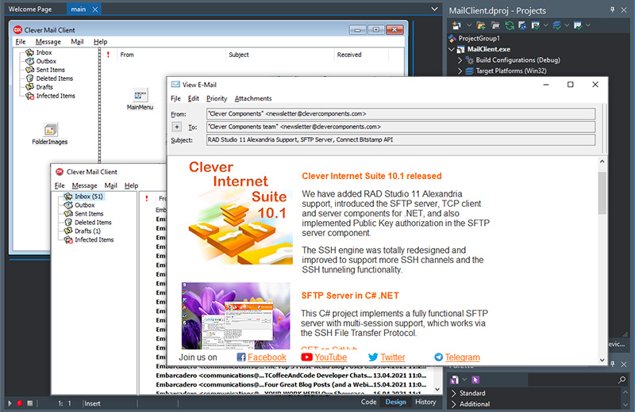

# MailClient with AntiVirus

This Delphi project represents a basic yet fully functional E-mail client, which utilizes the [TRichView](https://www.trichview.com/) components to display and edit HTML messages, Clever [SMTP](https://www.clevercomponents.com/products/inetsuite/smtp.asp) and [POP3](https://www.clevercomponents.com/products/inetsuite/pop3.asp) components to send and retrieve E-mails. The downloaded messages are scanned using the [ClamAV](https://www.clamav.net/) antivirus library.

Additionally, the program uses the [MailMessage](https://www.clevercomponents.com/products/inetsuite/messageparser.asp) component, which allows you to create E-mails in the MIME format, including message headers, text- and HTML bodies, file attachments, and embedded images.

The [HtmlViewer](https://github.com/BerndGabriel/HtmlViewer/) library is used for reading HTML bodies. The current version of MailClient utilizes the version 11.7.   

The program allows you to authenticate using the username/password information. Also the SMTP component supports the OAUTH2.0, Digest, NTLM, and other SASL authentication methods. Please check out the following example to learn how to use the OAUTH2.0 protocol together with this components: [GMail SMTP Client](https://github.com/CleverComponents/Clever-Internet-Suite-Examples/tree/master/Delphi/GMailSMTP)    

Both the SMTP and the POP3 client components completely support the SSL/TLS mode, including the client certificate authorization and the server validation process. The following example shows how to connect to a mail server via TLS: [SMTP Client SSL](https://github.com/CleverComponents/Clever-Internet-Suite-Examples/tree/master/Delphi/SmtpClientSSL) The other example connects to a POP3 mailbox using TLS: [POP3 Client SSL](https://github.com/CleverComponents/Clever-Internet-Suite-Examples/tree/master/Delphi/Pop3ClientSSL)   



[Read the Article](https://www.clevercomponents.com/articles/article034/mailclientav.asp)

## How to compile

1. Please clone the [GitHub/CleverComponents/MailClient-AntiVirus](https://github.com/CleverComponents/MailClient-AntiVirus) repository.
2. Download and install the [Clever Internet Suite](https://www.clevercomponents.com/downloads/inetsuite/suitedownload.asp) library.
3. Download and install the [TRichView](https://www.trichview.com/download/) library.
4. Download and install the [HtmlViewer](https://github.com/BerndGabriel/HtmlViewer/releases/tag/11.7) library.
5. Open and compile the MailClient project in your Delphi IDE.
6. Enjoy.

Daily virus databases (cvd files) should be downloaded and stored to the MailClient folder near the application executable: [ClamAV](https://www.clamav.net/)   

## Notes

The current version of the MailClient project uses an outdated version of ClamAV Delphi client library. You can still download it here: 
[ClamAV for Delphi](http://en.sourceforge.jp/frs/g_redir.php?m=jaist&f=%2Fvisualsynapse%2FSynapse+User+Contributions%2FTClamav+antivirus+delphi+component+using+libclamav+%28dll+included%29%2FTClamav.0.1.1.zip) This is a drawback, and we suggest a task to replace this library with [Delphi/Object Pascal ClamAV API Binding](https://github.com/reyjieroque/delphi-clamav) or any other antivirus library.   

## Units description

1. clRVSendMail.pas, contains:

``` delphi
procedure SendHTMLEmail(RV: TCustomRichView; Smtp: TclSmtp; Msg: TclMailMessage;
  HTMLKind: THTMLKind = htmlAdvanced; Attachments: TStrings = nil);
// This procedure sends a message. The message body is provided by the RV parameter,
// the other fields ("From", "To", "Subject") are from the Msg parameter.
// The message is sent using the Smtp component. You can provide an optional list of attached files.
If HTMLKind = htmlSimple, a basic HTML is used.
If HTMLKind = htmlAdvanced (recommended), HTML with CSS is used.
```

2. clRVSendDialog.pas, contains:

``` delphi
function ComposeAndSendHTMLEmail(Smtp: TclSmtp; Msg: TclMailMessage;
  HTMLKind: THTMLKind = htmlAdvanced): Boolean;
// Shows a dialog for editing a message and sending using both the Smtp and Msg parameters.
// "From", "To", "Subject" of e-mail are initialized using the corresponding properties of Msg.
```

3. clRVSendDialogEx.pas, contains:

``` delphi
procedure ViewHTMLEmail(MailSource: TStrings);
function EditHTMLEmail(MailSource: TStrings;
  HTMLKind: THTMLKind = htmlAdvanced): TMessageEditResult;
function ReplyToHTMLEmail(MailSource: TStrings; HowToReply: TMessageReplyKind;
  const From: String; HTMLKind: THTMLKind = htmlAdvanced;
  MaxLineLength: Integer = 80): TMessageEditResult;

(*where
  TMessageReplyKind  = (mekEdit, mekReply, mekReplyToAll, mekForward);
  TMessageEditResult = (meCancel, meSave, meSend);

  ViewHTMLEmail() displays the specified message.
  EditHTMLEmail() opens a window for editing the specified message.
  ReplyToHTMLEmail() opens a window for editing the specified message, 
    forwarding, or replying, depending on the HowToReply parameter.

  Parameters:
    MailSource - email source, this is clMailMessage.MessageSource.
    MaxLineLength is used to break lines when quoting text for replying or
    forwarding.

  This unit uses THTMLViewer and TrvHtmlViewImporter, see above.*)
```

Please feel free to [Contact Us](https://www.clevercomponents.com/support/) and ask any program related questions.   

Keep updated on [Facebook](http://www.facebook.com/clevercomponents)   [YouTube](https://www.youtube.com/channel/UC9Si4WNQVSeXQMjdEJ8j1fg)   [Twitter](https://twitter.com/CleverComponent)   [Telegram](https://t.me/clevercomponents)   [Newsletter](https://www.clevercomponents.com/home/maillist.asp)   
